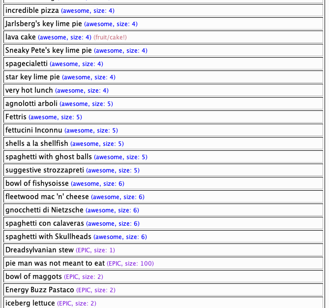

# pvpConsumption

Install in kolmafia like so

`svn checkout https://github.com/aahvocado/kolmafia-pvpconsumption/branches/master/kolmafia`

Make sure it has 'pvpSeason52_dates.txt' and 'fruitcake_list.txt' in "/data".


# Usage

Run it by executing the script, preferably from the CLI. There are a bunch of options but they're technically optional. (You can always type "help");

```
> pvpconsumption [inventory/inv/storage/stor] (pvp/any) (plain/color)
```
* inventory/inv/storage/stor - "inv" by default; tells the script where to look
* pvp/any - "any" by default; determines if searching for food you've never consumed, or just unique to the current pvp season
* plain/color - "color" by default; sometimes the fancy table kolmafia prints in the cli goes bork so plain is a way to just show it cleaner


There are some things you can configure in the script itself.
* Modify the QUALITY_SORT and SIZE_SORT variables to change the sorting logic.
* You can make it always plain by setting PLAIN_PRINT=true.
* Add excluded items.

## 🍓🍰
`pvpconsumption fruitcake`

## Screenshot

